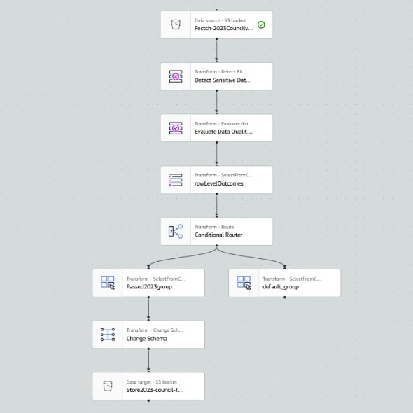
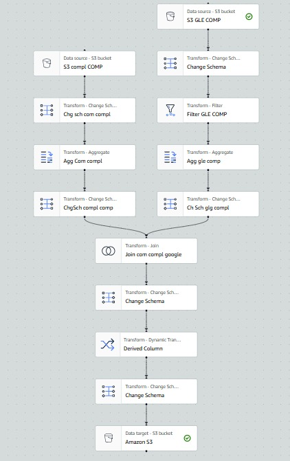

# data-analyst-hardeep

# Portfolio Projects

# Council Voting Records: Data Analysis and AWS Integration

**Project Description:**  
This project involves analyzing the Council Voting Records dataset for the City of Vancouver for the years 2023 and 2024. The goal is to manage and analyze the voting patterns and decisions made by council members, ensuring data integrity, security, and generating insights through automated processes using AWS.

## Objective:  
The primary aim is to analyze voting patterns, participation rates, and decision outcomes using the dataset. Data was ingested, protected, and processed using AWS services, with key insights visualized through dashboards.

## Dataset:  
- **Columns:** Meeting Type, Vote Date, Voter Number, Agenda Description, Vote Start Date, Time, Vote Decision, and Vote Details ID.
- The dataset includes voting records for 2023 (7032 rows) and 2024 (3908 rows).

## Methodology:  
1. **Data Ingestion:**  
   The dataset was extracted from the City of Vancouver portal and uploaded to AWS S3 for storage.
   
2. **Data Protection:**  
   AWS Glue and AWS KMS were used for encrypting data at rest and managing access. IAM roles provided controlled access, ensuring only authorized personnel could access the dataset.

3. **Data Cleaning and Structuring:**  
   AWS Glue DataBrew was employed to clean and structure the dataset, filling in missing values, and transforming the data into a consistent format for analysis.

4. **Data Analysis:**  
   SQL queries were run using AWS Athena to analyze participation rates, decision trends, and voting outcomes for various agenda items.  

5. **Data Visualization:**  
   Dashboards were created in Amazon QuickSight to visualize:
   - Voting participation trends over time.
   - Voting outcomes ("In Favour" vs. "Against") across different agenda items and meetings.
   - Analysis of council members' voting behavior.

## Tools & Technologies:  
- AWS S3, AWS Glue, AWS KMS, AWS Athena, AWS QuickSight, Python.

## Deliverables:  
- Cleaned and structured Council Voting Records dataset stored in AWS S3.
- Dashboards visualizing voting trends, participation rates, and decision-making patterns.
- Automated ETL pipeline for continuous data processing and analysis.

## Image:

---

# Student Rights and Responsibilities Procedure

**Project Description:**  
This document outlines the procedures to support the Student Rights and Responsibilities Policy at UCW, detailing how complaints and allegations of student misconduct are addressed.

## Objective:  
To ensure a fair process for handling complaints of student misconduct, with clear steps from complaint submission to resolution.

## Procedure Overview:  
1. **Complaint Submission:**  
   Complaints can be submitted by students, faculty, or staff, and are reviewed by the Student Rights & Responsibilities Advisor.

2. **Interim Measures:**  
   Temporary actions like restricting campus access may be implemented if misconduct is deemed a risk.

3. **Investigation Process:**  
   If informal resolution fails, the advisor initiates an investigation to gather evidence and determine outcomes.

4. **Outcomes:**  
   Sanctions range from warnings to expulsion, depending on the severity of the violation.

## Tools & Technologies:  
- UCW internal systems for managing complaints and documentation.

## Deliverables:  
- A consistent and fair process for resolving student misconduct issues.
- Proper documentation stored in student records for reference.

## Image:

## Steps

# Student Rights and Responsibilities Procedure

## 1. Purpose
This Procedure is designed to support the Student Rights and Responsibilities Policy (the “Policy”).

## 2. Definitions
The definitions in Policy 9014 Student Rights and Responsibilities apply to this Procedure.

## 3. Student Misconduct Procedure
3.1 Any member of the UCW Community (student, faculty, or staff) may make an allegation or complaint against any student(s) for misconduct (the “Complainant”).

3.2 Complaints can be made to the Department of Student Affairs, the Student Rights & Responsibilities Advisor, an instructor, or a Department Chair. All complaints shall be immediately referred to the Student Rights & Responsibilities Advisor for advisement.

3.3 Upon becoming aware of the Complaint, the Student Rights & Responsibilities Advisor will conduct an initial review to determine whether the facts giving rise to the Complaint would, if true, constitute a violation of the Student Rights and Responsibilities Policy. If not, the matter is considered concluded, and no further steps will be taken. If so, then further steps under these Procedures will be followed. The student(s) subject of the Complaint (the “Respondent”) will be notified that a Complaint has been made and the substance of it.

## 4. Interim Measures
4.1 At any time following the receipt of the Complaint, the Vice-President Academic may impose interim measures where the alleged misconduct is considered to constitute a danger to persons or property or to be impeding a member of UCW from exercising their rights or carrying out activities on campus. Interim measures may be imposed pending the possible imposition of outcomes and may be removed after outcomes have been imposed. Interim measures are to be short-term measures aimed at maintaining the peaceable functioning of the UCW campus.

4.2 Interim measures may include:
- a) Limitation of access to all or part of the campus for a period not exceeding ten (10) days.
- b) A direction that a Respondent ceases and desists from communication with another member of the UCW Community.
- c) Exclusion from online UCW resources.
- d) Such other measures that are proportionate to the seriousness of the alleged misconduct and that are as minimally restrictive as possible upon the Respondent to achieve their academic purpose.

4.3 The Respondent shall be informed in writing of the Interim Measure and the reasons for such measures as soon as possible, but no later than two (2) business days following the imposition of interim measures.

4.4 The Respondent may respond in writing to the interim measures to the Vice-President Academic who shall review the interim measures and either revoke, change, or affirm them.

## 5. Informal Process
5.1 At any stage of this Procedure, the Complaint may be addressed through an Informal Process at the recommendation of the Student Rights & Responsibilities Advisor. An Informal Process is a consensual process. The specifics of the Informal Process will depend upon the circumstances of the Complaint and will be structured with a view to achieving a mutually acceptable resolution of the Complaint.

5.2 An Informal Process may involve the gathering of facts by the Student Rights & Responsibilities Advisor and the use of mediation. The informal Process may involve a Complainant, Faculty, staff, or others, as appropriate.

5.3 The use of the Informal Process is encouraged and should proceed in a timely manner.

5.4 Outcome agreed upon during the Informal Process is not subject to the Appeals for Non-Academic Misconduct Policy (Policy 9011).

## 6. Investigation of Complaint
6.1 If the Informal Process fails or is inappropriate in the circumstances, the Student Rights & Responsibilities Advisor will either conduct an impartial investigation of the Complaint, refer the Complaint to the VP Academic, assemble a committee or recommend to the VP Academic to appoint an external investigator to conduct the investigation (the “Investigator”).

6.2 The investigation will normally be commenced within 7 business days from the date the Complaint was filed or when it is determined that the Informal Process did not achieve any outcome.

6.3 Prior to the conduct of an investigation, the Respondent will be informed of the substance of the Complaint and that an investigation will be initiated.

6.4 The Investigator will determine the appropriate procedures for the investigation depending on the Complaint. Typically, the investigation process will include the following:
- a) The Respondent is given notice of the Complaint with sufficient time and detail to allow the Respondent to understand the nature of the complaint and to be able to fairly respond to it. This notice will provide the Respondent with the material details of the Complaint.
- b) The Investigator may contact Department Chairs(s), Department Head(s), students, or other parties involved, etc. that may have relevant information concerning the Complaint. The Investigator may both interview and collect documents related to the investigation of the Complaint.
- c) The Respondent will be provided with a summary of the information received during the investigation and be given an opportunity to fairly respond.

6.5 Following the conclusion of the investigation, the Investigator will report to the Director of Student Affairs their findings regarding the Complaint and, if appropriate, make recommendations as to the Outcome.

## 7. Decision
7.1 Following the receipt of the Investigator’s findings and recommendations, the Director of Student Affairs may:
- a) Accept the findings of the Investigator, as to whether or not a breach of the Policy occurred.
- b) Reject the findings of the Investigators and either (i) require future investigation or (ii) dismiss the Complaint or (iii) find that a breach of the Policy occurred.

7.2 The Director of Student Affairs may impose Outcomes where a breach of the Policy is found. The Director of Student Affairs may refer the parties to the Informal Process if it may be beneficial to the resolution of the matter.

7.3 Within 10 business days of the receipt of the investigator’s findings, the Director of Student Affairs will communicate its decision, the result of the investigation, as appropriate, and the Outcomes, as applicable, to the Respondent.

7.4 The Complaint, investigation, and decision will be added to the Student’s file and the allegations and nature of the Complaint may be considered when addressing other instances of misconduct.

## 8. Outcomes
8.1 While a variety of disciplinary Sanctions in response to the misconduct may be imposed, the Director of Student Affairs may consider educational, developmental and restorative outcomes instead of or in conjunction with Disciplinary Sanctions.

8.2 The disciplinary Sanction will vary according to the following factors:
- a) The nature and the severity of the misconduct.
- b) The impact the misconduct has on the University Community.
- c) The inadvertent or deliberate nature of the misconduct.
- d) Whether the Respondent accepts responsibility for the misconduct.
- e) Whether the misconduct is an isolated incident.
- f) Any other mitigating or aggravating circumstances.

8.3 The Respondent may receive more than one Disciplinary Sanction for misconduct. The Disciplinary Sanctions may include, but are not limited to:
- a) The Respondent may be required to provide a verbal or written apology.
- b) The Respondent may be required to make restitution in the form of payment of costs, or compensation for loss, damage, or injury, or in the form of appropriate service or material replacement.
- c) The Respondent may receive a verbal or written warning or Letter of Reprimand.
- d) The Respondent may be placed on non-academic probation for a specified period of time.
- e) The Respondent may lose privileges for a specified period of time, including computer privileges, library access, or be prohibited from registering for a particular course or program.
- f) The Respondent may be prohibited for a specified period of time from having access to all or any part of the campus, with or without conditions.
- g) The Respondent may be removed from one or more courses for one or more terms.
- h) The Respondent may be suspended with the loss of all academic privileges for a specified period of time.
- i) The Respondent may be subject to suspension, cancellation, or forfeiture of any scholarships, bursaries or prizes.
- j) The Respondent may forfeit payment for courses, registration, or other fees.
- k) The Respondent may be required to enter into and abide by a behavioural contract. Any breach of this contract constitutes misconduct that may result in suspension or expulsion from UCW.
- l) The Respondent may be required to have no direct or indirect contact with a named individual or group.
- m) The Respondent may be suspended from the University for a specified period of time.
- n) The Respondent may be required to abide by a behavioural contract prior to their return to campus.
- o) The Respondent may be denied admission or re-admission to the University for a specified or indefinite period of time.
- p) The Respondent may be expelled from UCW by the President.
- q) The Respondent may receive a notation of academic discipline on the student's record in the Student Information System, which will appear on the student's Transcript of Academic Record.

8.4 A student who willfully fails or refuses to comply with a sanction shall be considered to have committed student misconduct and shall be liable to a period of suspension of up to two (2) years.

8.5 When a sanction is imposed, the Respondent shall be advised in writing of their right to appeal.

## 9. Recording the Sanction
9.1 The Director of Student Affairs' decision above shall be recorded in writing and delivered to the Respondent, with a copy sent to the Office of the Registrar for the Student’s official record.

9.2 When a Respondent is suspended from UCW, the Registrar shall enter the period of suspension on the Student’s transcript for the period of the sanction. At the conclusion

9.3 When a Respondent is expelled from the UCW, the Registrar shall enter the expulsion on the transcript where it shall remain as a permanent record.

## 10. Miscellaneous  
A student who is a study permit holder with a suspension may be reported to the Immigration, Refugees and Citizenship Canada (IRCC).   
10.1.	A student who is found to have violated the law may be referred to the appropriate authority at the University’s discretion.

## 11.	Privacy and Record retention  
11.1.	Privacy and confidentiality of the students involved in the process above will be prioritized. The complainant may not be informed of the outcome of the process, and similarly, the student(s) name in the complaint may not be aware of the identity of the complainant.  

11.2.	Record created as a result of actions taken under the Policy and these procedures shall be marked as confidential, and their access is restricted to protect students’ rights to privacy and will be maintained in with the Office of the Registrar with access only to designate individuals. Only the Student Rights & Responsibilities Advisor and the VP Academic will have access to student records regarding matter under this Policy unless otherwise reasonably required by another person for legitimate and lawful purposes.  

---

